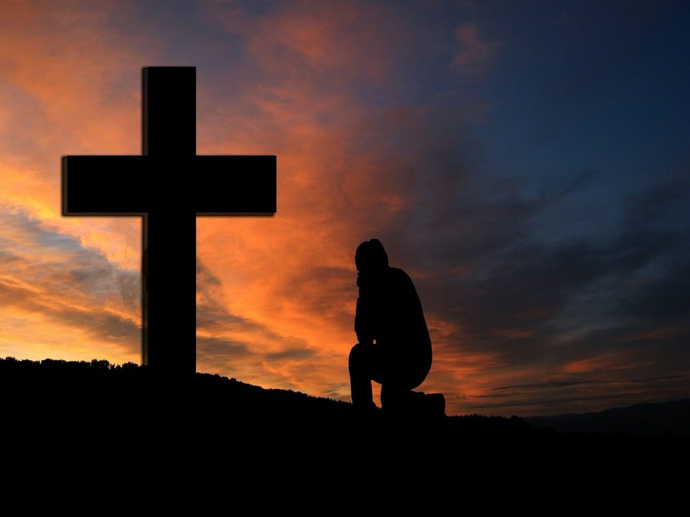

# **Lecturas Bíblicas del Mes de Agoosto 2023**

##  13 de Agosto de 2023 :material-calendar-heart:
### Pueblo Humillado ante Dios

???+ abstract "2 Crónicas 7:12-22"
    <figure markdown><figcaption>"Humildes ante Dios"</figcaption>
    {width=300} </figure>
    **Versículos**:

    > _ **2 Crónicas 7:12-22**. 12.  Y apareció Jehová a Salomón de noche, y le dijo: Yo he oído tu oración, y he elegido para mí este lugar por casa de sacrificio.  13. Si yo cerrare los cielos para que no haya lluvia, y si mandare a la langosta que consuma la tierra, o si enviare pestilencia a mi pueblo; **14. si se humillare mi pueblo, sobre el cual mi nombre es invocado, y oraren, y buscaren mi rostro, y se convirtieren de sus malos caminos; entonces yo oiré desde los cielos, y perdonaré sus pecados, y sanaré su tierra.**  15. Ahora estarán abiertos mis ojos y atentos mis oídos a la oración en este lugar;  16. porque ahora he elegido y santificado esta casa, para que esté en ella mi nombre para siempre; y mis ojos y mi corazón estarán ahí para siempre.  17. Y si tú anduvieres delante de mí como anduvo David tu padre, e hicieres todas las cosas que yo te he mandado, y guardares mis estatutos y mis decretos,  18. yo confirmaré el trono de tu reino, como pacté con David tu padre, diciendo: No te faltará varón que gobierne en Israel.  19. Mas si vosotros os volviereis, y dejareis mis estatutos y mandamientos que he puesto delante de vosotros, y fuereis y sirviereis a dioses ajenos, y los adorareis,  20. yo os arrancaré de mi tierra que os he dado; y esta casa que he santificado a mi nombre, yo la arrojaré de mi presencia, y la pondré por burla y escarnio de todos los pueblos.  21. Y esta casa que es tan excelsa, será espanto a todo el que pasare, y dirá: ¿Por qué ha hecho así Jehová a esta tierra y a esta casa?  22. Y se responderá: Por cuanto dejaron a Jehová Dios de sus padres, que los sacó de la tierra de Egipto, y han abrazado a dioses ajenos, y los adoraron y sirvieron; por eso él ha traído todo este mal sobre ellos._

    **Mensaje Aprendido**:

    - Muchas veces que he leído estos versos me acuerda a que Dios muy misericordioso con nosotros y a pesar de que nosotros somos desobedientes; Él se compadece con nosotros dandonos la oportunidad de arrepentirnos y buscarle como Él desea para seguir sus estatutos. 
    -  Por ende, Dios nos solicita de nosotros una humillación delante de su presencia a pesar de todos nuestros pecados, Dios tiene fe que nosotros nos humillemos y entreguemos todas nuestras cargas a Él para que Él mismo obre a voluntad de sus planes que tiene con nosotros. 
    - Dios nos espera con los brazos abiertos para adorarle, humillados ante su presencia, y arrepentidos de corazón para ser salvos.

???+ tip "Total Mensual de Lecturas Bíblicas :fontawesome-solid-book-bible:" 
    - Total de Libros leídos: 1
    - Total de Capítulos leídos: 1
    - Total de Versículos leídos: 11