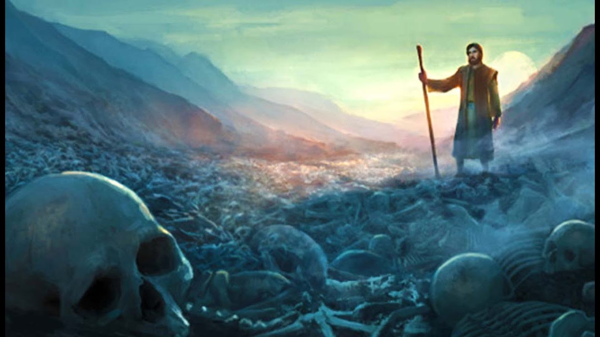

# **Lecturas Bíblicas del Mes de Octubre 2023**

##  Octubre de 2023 :material-calendar-heart:
###  

???+ abstract "Ezequiel 37:1-14"
    <figure markdown><figcaption>"Valle de los Huesos Secos"</figcaption>
    {width=300} </figure>
    **Versículos**:

    > _ **Ezequiel 37: 1-14**. 1. La mano de Jehová vino sobre mí, y me llevó en el Espíritu de Jehová, y me puso en medio de un valle que estaba lleno de huesos. 2. Y me hizo pasar cerca de ellos por todo en derredor; y he aquí que eran muchísimos sobre la faz del campo, y por cierto secos en gran manera. 3. Y me dijo: Hijo de hombre, ¿vivirán estos huesos? Y dije: Señor Jehová, tú lo sabes. 4. Me dijo entonces: Profetiza sobre estos huesos, y diles: Huesos secos, oíd palabra de Jehová. 5. Así ha dicho Jehová el Señor a estos huesos: He aquí, yo hago entrar espíritu en vosotros, y viviréis. 6. Y pondré tendones sobre vosotros, y haré subir sobre vosotros carne, y os cubriré de piel, y pondré en vosotros espíritu, y viviréis; y sabréis que yo soy Jehová.7. Profeticé, pues, como me fue mandado; y hubo un ruido mientras yo profetizaba, y he aquí un temblor; y los huesos se juntaron cada hueso con su hueso. 8. Y miré, y he aquí tendones sobre ellos, y la carne subió, y la piel cubrió por encima de ellos; pero no había en ellos espíritu. 9. Y me dijo: Profetiza al espíritu, profetiza, hijo de hombre, y di al espíritu: Así ha dicho Jehová el Señor: Espíritu, ven de los cuatro vientos, y sopla sobre estos muertos, y vivirán. 10. Y profeticé como me había mandado, y entró espíritu en ellos, y vivieron, y estuvieron sobre sus pies; un ejército grande en extremo. 11. Me dijo luego: Hijo de hombre, todos estos huesos son la casa de Israel. He aquí, ellos dicen: Nuestros huesos se secaron, y pereció nuestra esperanza, y somos del todo destruidos. 12. Por tanto, profetiza, y diles: Así ha dicho Jehová el Señor: He aquí yo abro vuestros sepulcros, pueblo mío, y os haré subir de vuestras sepulturas, y os traeré a la tierra de Israel. 13. Y sabréis que yo soy Jehová, cuando abra vuestros sepulcros, y os saque de vuestras sepulturas, pueblo mío. 14. Y pondré mi Espíritu en vosotros, y viviréis, y os haré reposar sobre vuestra tierra; y sabréis que yo Jehová hablé, y lo hice, dice Jehová._

    **Mensaje Aprendido**:

    - Al principio, muchas veces cuando leemos este pasaje nos preguntamos: ¿Será una parábola o una visión o quizás un hecho? Pues desde mi punto de vista diré que es una visión, porque si leemos cuidadosamente el versículo 1 donde dice "_La mano de Jehová vino sobre mí..._" implica que Jehová vino sobre Ezequiel a mostrarle algo, una visión, donde le enseñaría una profecía sobre el pueblo de Israel que ellos se sentiran destruidos, cansados, agotados, pero Jehová les quiere impartir el mensaje que no hay nada imposible para El, porque Jehová levantará hasta los huesos secos para crear un ejército de soldados donde batallan la buena palabra de la fe demonstrando el gran poder que Dios tiene.
    - Dicho esto, Dios muchas veces nos muestra, nos dice y nos enseña que debemos depender completamente en él porque para Dios no hay nada imposible. Cuando Dios nos muestra cosas, situaciones en la vida es para enseñarnos que solo debemos depender de él para poder continuar. A veces nos dice, nos susura al oído para solo dejarnos saber que esta allí para nosotros. Y finalmente, nos enseña que por más díficil sean las situaciones en la vida, que sin Dios no lograremos nada. 

???+ tip "Total Mensual de Lecturas Bíblicas :fontawesome-solid-book-bible:" 
    - Total de Libros leídos: 1
    - Total de Capítulos leídos: 1
    - Total de Versículos leídos: 14