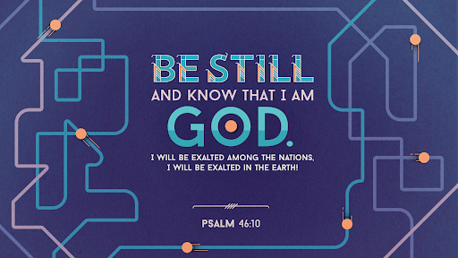

# **Lecturas Bíblicas del Mes de Julio 2024**

## 02 de julio de 2024 :material-calendar-heart:

???+ abstract "Salmos 46:1-11"
    <figure markdown><figcaption>Dios es Nuestra Fortaleza</figcaption>
    { width="300" }</figure>

    **Versículos**:

    > _ **Salmos 46:1-11**  1_. Dios es nuestro amparo y fortaleza, Nuestro pronto auxilio en las tribulaciones.  _ 2_. Por tanto, no temeremos, aunque la tierra sea removida, Y se traspasen los montes al corazón del mar;  _ 3_. Aunque bramen y se turben sus aguas, Yy tiemblen los montes a causa de su braveza.  _ 4_. Del río sus corrientes alegran la cuidad de Dios, El santuario de las moradas del Altísimo.  _ 5_. Dios está en medio de ella; no será conmovida. Dios la ayudará al clearear la mañana.  _ 6_. Bramaron las naciones, titubearon los reinos; Dio él su voz, se derritió la tierra.  _ 7_. Jehová de los ejércitos está con nosotros; Nuestro refugio es el Dios de Jacob.  _ 8_. Venid, ved las obras de Jehová, Que ha puesto asolamientos en la tierra.  _ 9_. Que hace cesar las guerras hasta los fines de la tierra. Que quiebra el arco, corta la lanza, Yy quema los carros en el fuego.  _ 10_. Estad quietos, y conoced que yo soy Dios; Seré exaltado entre las naciones; enaltecido seré en la tierra.  _ 11_. Jehová de los ejércitos está con nosotros; Nuestro refugio es el Dios de Jacob.

    **Reflexión**:
    > Dios es nuestra fuente constante de fortaleza y refugio, sin importar cuán caótica se vuelva la vida. Piensa en situaciones en las que sentiste que todo se desmoronaba. ¿Cómo experimentaste la fortaleza de Dios durante esos momentos?

    - Muchas veces en la vida no vemos que Dios está obrando y nos desesperamos donde entonces tomamos decisiones apresuradas que incluso nos lleva a grandes consecuencias. 
    - Queremos demonstrar que podemos con nuestras propias fuerzas y nos olvidamos que Dios está ahí para brindarnos la ayuda necesaria para levantarlos.
    - Una vez cuando estuve en una situación difícil fue cuando no veía que nadie le importaba cómo yo estaba y tomé decisiones apresuradas donde solo Dios pudo ayudarme justo a tiempo para luego no cometer la decisión equivocada. Sólo Dios sabe el porque Él permite las cosas en la vida.
    - Le doy gracias a Dios porque estuvo en ese momento de mi vida junto a mi lado para hacerme entender que solo Él tiene el control de toda situación que nos enfrentemos. 

    **Oración**:
    > Pídele a Dios que te recuerde "Su fortaleza y ayuda siempre esten presente como prontro auxilio en las tribulaciones."

???+ tip "Total Mensual de Lecturas Bíblicas :fontawesome-solid-book-bible:" 
    - Total de Libros leídos: 0 (estan repetidos)
    - Total de Capítulos leídos: 11
    - Total de Versículos leídos: 11