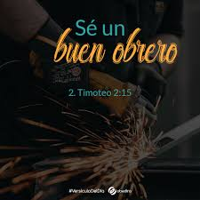
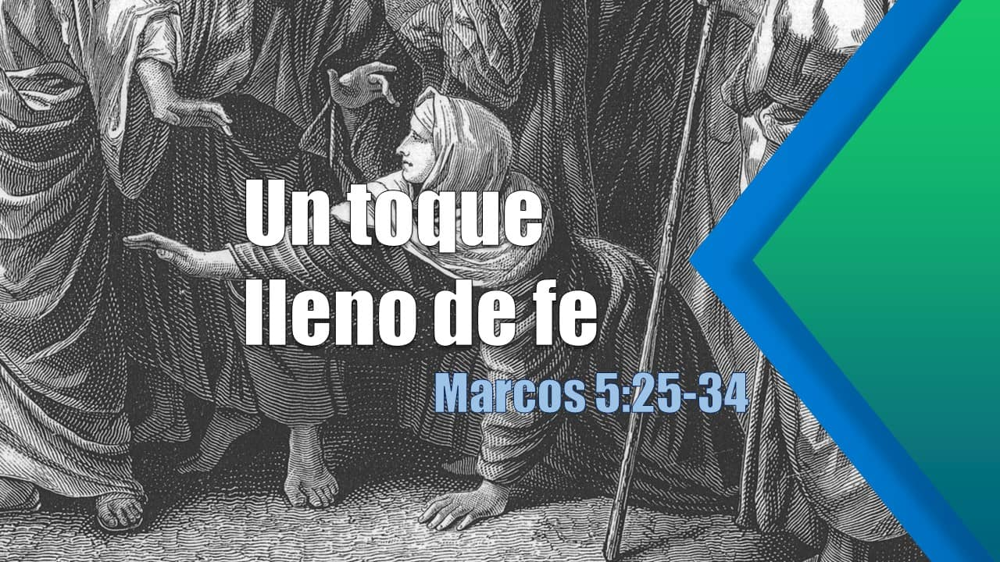

# **Lecturas Bíblicas del Mes de Enero 2023**

## 27 de enero de 2023 :material-calendar-heart:

???+ abstract "2nda Timoteo 2:14-16"
    <figure markdown><figcaption>Un Obrero Aprovado No Se Avergüenza!</figcaption>
    { width="300" }</figure>

    **Versículos**:

    > _14. Recuérdales esto, exhortándoles delante del Señor que no contiendan sobre palabras, lo cual para nada aprovecha, sino que es para perdición de los oyentes. 15. Procura con diligencia presentarte a Dios aprobado, como obrero que no tiene de qué avergorzarse, que usa bien la palabra de verdad. 16. Mas evita profanas y vanas palabrerías, porque conducirán más y más a  la impiedad._
    
    **Mensaje Aprendido**:

    - De acuerdo a los textos bíblicos y referencias, este mensaje viene de parte como consejo de Pablo hacia Timoteo. Pablo le está explicando a Timoteo que a veces hablamos temas (palabras) que no edifican o que no nos ayudan a entender la palabra que Dios nos quiere transmitir a través de sus métodos. 
    - El versículo 15 menciona:
        
        > 2 Timoteo 2:15 "Procura con diligencia presentarte a Dios aprobado, como obrero que no tiene de qué avergorzarse, que usa bien la palabra de verdad."
        
        - Se refiere a que debemos levantar nuestra frente en alto y sin vergüenza alguna de llevar o hablar la palabra de Dios y no a conveniencia de nosotros sino a conveniencia de Dios por más fuerte que sean las palabras o mensaje.
        - Cuando pequeña estuve en un grupo cristiano que se llamaba **OANSA**  y cada visita, reunión o "culto" teníamos que aprendernos un versículo bíblico de memoria y presentarlo al frente de todos (eramos bastantes como 15 a 20 niñ@s). 
            - **OANSA** significa (o significaba al momento desconozco si aún siguen en reuniendose):
                - **O**: **O**breros
                - **A**: **A**probados
                - **N**: **N**o
                - **S**: **S**e
                - **A**: **A**vergüenzan
            - El propósito de este grupo (de personas jóvenes) era para que los niñ@s tuviesen la oportunidad aunque sea los sábados; poder escuchar palabra de Dios que existía y que al confiar en Él (Dios) todo obraría para bien. 
        - En fin, el mensaje es independientemente de las situaciones o temas que hablemos con otros siempre intentemos ser diligentes (sabios o prudentes) al impartir la palabra de Dios.

## 28 de enero de 2023 :material-calendar-heart:

???+ abstract "Santiago 4:1-10"
    <figure markdown><figcaption>Resistid al diable y él huirá de nosotros!</figcaption>
    { width="300" }</figure>

    
    **Versículos**:

    > _1. ¿De dónde vienen las guerras y los pleitos entre vosotros? ¿No es de vuestras pasiones, las cuales combaten en vuestros miembros?  2. Codiciáis, y no tenéis; matáis y ardéis de envidia, y no podéis alcanzar; combatís y lucháis, pero no tenéis lo que deseáis, porque no pedís.  3. Pedís, y no recibís, porque pedís mal, para gastar en vuestros deleites.  4. ¡Oh almas adúlteras! ¿No sabéis que la amistad del mundo es enemistad contra Dios? Cualquiera, pues, que quiera ser amigo del mundo, se constituye enemigo de Dios.  5. ¿O pensáis que la Escritura dice en vano: El Espíritu que él ha hecho morar en nosotros nos anhela celosamente?  6. Pero él da mayor gracia. Por esto dice: Dios resiste a los sobervios, y da gracia a los humildes.  **7. Someteos, pues, a Dios; resistid al diablo, y huirá de vosotros.**  8. Acercaos a Dios, y él se acercará a vosotros. Pecadores, limpiad las manos; y vosotros los de doble ánimo, purificad vuestros corazones.  9. Afligíos, y lamentad, y llorad. Vuestra risa se convierta en lloro, y vuestro gozo en tristeza.  10. Humillaos delante del Señor, y él os exaltará._

    **Mensaje Aprendido**:

    - Este pasaje siempre me va hacer pensar en la película __War Room__ porque me identifique la joven protagonista. 
    - Muchas veces necesitamos que alguien nos ayude a levantar nuestros ánimos y permanecer firmes y no desmayar. No rendirnos, pero muy pocas veces nos encontramos con personas que nos apoyen y nos brinden esas palabras de aliento que estamos buscando.
    - Aquí viene este pasaje, comienza con varias preguntas, indicando que debemos detectar o identificar cual es nuestro problema, cual es la razón de ser como somos. 
    - Cuestionandonos porque debemos abstenernos de compartir cosas que no nos conviene, y buscar como agradar a Dios. 
    - Las pruebas a veces son fáciles, pero muchas de las veces van a ser difíciles y por eso Dios nos enfatiza que debemos someternos, llenarnos más, buscar más, redimirnos y confiar más en Dios, porque sino obligamos nuestra carne (cuerpo) nunca llegaríamos a buscar a Dios. 
    - Estaríamos siempre con un vacío que nada lo puede llenar solo Dios con su miseriacordia y gozo, nos llena de esa gracia y paz que anhelamos encontrar.
        

## 29 de enero de 2023 :material-calendar-heart:

???+ abstract "Marcos 5:21-34"
    
    <figure markdown><figcaption>Por la fe seremos salvos!</figcaption>
    { width="300" }</figure>

    **Versículos**:

    > _21. Pasando otra vez Jesús en una barca a la otra orilla, se reunió alrededor de él una gran multitud; y él estaba junto al mar.   22. Y vino uno de los principales de la sinagoga, llamado Jairo; y luego que le vio, se postró a sus pies,   23. y le rogaba mucho, diciendo: Mi hija está agonizando; ven y pon las manos sobre ella para que sea salva, y vivirá.   24. Fue, pues, con él; y le seguía una gran multitud, y le apretaban.   25. Pero una mujer que desde hacía desde doce años padecía de flujo de sangre,  26. y había sufrido mucho de muchos médicos, y gastado todo lo que tenía, y nada había aprovechado, antes le iba peor,   27. cuando oyó hablar de Jesús, vino por detrás entre la multitud, y tocó su manto.  28. Porque decía: Si tocare tan solamente el manto, seré salva.  29. Y en seguida la fuente de su sangre se secó; y sintió en el cuerpo que estaba sana de aquel azote.  30. Luego Jesús, conociendo en sí mismo el poder que había salido de ;el, volviéndose a la multitud, dijo: ¿Quién ha tocado mis vestidos?   31. Sus discípulos le dijeron: Ves que la multitud te aprieta, y dices: ¿Quién me ha tocado?   32. Pero él miraba alrededor para ver quién había hecho esto.   33. Entonces la mujer, temiendo y temblando, sabiendo lo que en ella había sido hecho, vino y se postró delante de él, y le dijo toda la verdad.   34. Y él le dijo: Hija, tu fe te ha hecho salva; ve en paz, y queda sana de tu azote._

    **Mensaje Aprendido**:

    - En este histórico y reconocido pasaje donde la mujer de flujo de sangre fue sanada y salva por su fe. En realidad, solo pensamos que fácil sería pensar como esta mujer y me gustaría tener esa fe. 
    - Yo en lo personal me identifico mucho con esta mujer por su condición de salud. Un poco más sobre mi, sería que yo en la actualidad tengo problemas hormonales, y esto a ocasionado que mis ciclos menstruales duren mucho más de lo usual y a veces ni me ha interesado buscar ayuda.
    - Entonces Cuando pienso, ¿porque esta mujer ha gastado tanto dinero para resolver este problema? Tenemos que entender que este pasaje está escrito en otra época. Una mujer con este tipo de condición era rechazada y juzgada porque era "inmunda".
    - Por ende, esto significa que ella buscaba la manera para poder ser aceptada y sentirse parte de la comunidad y no despreciada o rechaza. Buscaba sentirse limpia, sana y salva. 
    - Aquí entonces viene la parte impresionante, ella con su fe, solo repitía varias veces: "Si tan sólo, tocase el borde de su manto, seré salva". Puedes creer, que si lo comparamos hoy día es como decir tener fe como un grano de mostaza y esa montaña se moverá y que la montaña se mueva (algo imposible... lo sé).
    - Hay que entender, que Dios no se equivoca, Él tiene todo pre-meditado; ya tiene un propósito en nuestras vidas, solo tenemos que confiar plenamente en Él y Él obrará. Hará que se mueva esa montaña, hará que los ciegos vean, los mudos hablen y los cojos caminen. 
    - Por eso, es importante entender que el mundo no nos dará la solución a nuestros problemas sino la fe que tengamos con Dios porque él nos guiará hacia el camino de la verdad. Nuestra salvación.

## 31 de enero de 2023 :material-calendar-heart:

???+ abstract "Salmos 139: 1-24"

    <figure markdown><figcaption>Maravillado por sus obras!</figcaption>
    { width="300" }</figure>

    **Versículos**:

    > _1. Oh Jehová, tú me has examinado y conocido.   2. Tú has conocido mi sentarme y mi levantarme;   Has entendido desde lejos mis pensamientos.   3. Has escudriñado mi andar y mi reposo,   Y todos mis caminos te son conocidos.   4. Pues aún no está la palabra en mi lengua,   Y he aquí, oh Jehová, tú la sabes toda.   5. Detrás y delante me rodeastes,  Y sobre mí pusistes tu mano.  6. Tal conocimiento es demasiado maravilloso para mí;   Alto es, no lo puedo comprender.   7. ¿A dónde me iré de tu Espíritu? ¿Y a dónde huiré de tu prensencia?  8. Si subiere a los cielos, allí estás tú;   Y si en el Seol hiciere mi estrado, he aquí allí tú estás.  9. Si tomare las alas del alba  Y habitare en el extremo del mar,   10. Aun allí me guiará tu mano,   Y me asirá tu diestra.  11. Si dijere: Ciertamente las tinieblas me encubrirán;   Aun la noche resplandecerá alrededor de mí.  12. Aun las tinieblas no encubren de ti,  Y la noche resplandece como el día; Lo mismo te son las tinieblas que la luz. 13. Porque tú formaste mis estrañas;  Tú me hiciste en el vientre de mi madre. 14. Te alabaré; porque formidables, maravillosas son tus obras; Estoy maravillado,  Y mi alma lo sabe muy bien.  15. No fue encubierto de ti mi cuerpo, Bien que en oculto fui formado, y entretejido en lo más profundo de la tierra.  16. Mi embrión vieron tus ojos,  Y en tu libro estaban escritas todas aquellas coasas  Que fueron luego fromadas,   Sin faltar algunas de ellas.  17. ¡Cuán preciosos me son, oh Dios, tus pensamientos!  ¡Cuán grande es la suma de ellos! 18. Si los enumero, se multiplican más que la arena;  Despierto, y aún estoy contigo. 19. De cierto, oh Dios, harás morir al impío.  Apartaos, pues, de mí, hombres sanguinarios.  Porque blasfemias docen ellos contra ti;   Tus enemigos toman en vano y nombre.  20. Porque blasfemias dicen ellos contra ti;   Tus enemigos toman en vano tu nombre.  21. ¿No odio, oh Jehová, a los que te aborrecen,  Y me enardezco contra tus enemigos?  22. Los aborrezco por completo;  Los tengo por enemigos. 23. Examíname, oh Dios, y conoce mi corazón; Pruébame y conoce mis pensamientos; 24. Y ve si hay en mi camino de perversidad, Y guíame en el camino eterno._
     
    **Mensaje Aprendido**:
    
    - Entiendo que no importando lo que pase en nuestras vidas, la presencia de Dios siempre estará con nosotros. 
    -  A veces pensamos que Dios no nos escucha, que no cumplirá su promesa o propósito en nuestras vidas, pero Dios tiene planes con nosotros que nosotros desconocemos. Es mejor dejarle a Dios a cargo de nuestras dificultades y confiar plenamente en Él para que haga su voluntad sobre nosotros.  

???+ tip "Total Mensual de Lecturas Bíblicas :fontawesome-solid-book-bible:" 
    - Total de Libros leídos: 4
    - Total de Capítulos leídos: 4
    - Total de Versículos leídos: 50